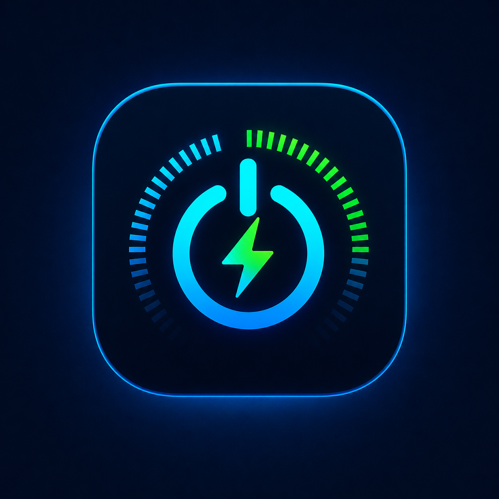

<div align="center">



# VoltManager

**Il telecomando della batteria e delle prestazioni del tuo PC Windows.**
Un solo posto per far andare il computer più veloce quando serve, più silenzioso e parco quando no — senza smanettare nelle impostazioni nascoste di Windows.


</div>

---

## Cos'è, in parole semplici

Il tuo PC ha tre "marce": **Risparmio energia**, **Bilanciato** e **Prestazioni**.
Windows le nasconde in menù poco intuitivi e raramente le cambia da solo al momento giusto.

**VoltManager** mette quelle marce a portata di clic e — soprattutto — le cambia **automaticamente** per te:

- 🔋 **Stacchi il portatile dalla corrente?** Passa da solo a risparmio energetico per far durare di più la batteria.
- 🔌 **Lo ricolleghi?** Torna alle prestazioni piene.
- 🎮 **Apri un gioco o un programma pesante?** Spinge il PC al massimo, e ti ricorda di tornare alla modalità normale quando hai finito.
- 😴 **Stai guardando un film?** Tieni lo schermo sveglio senza toccare nessuna impostazione.

Pensato per **tutta la famiglia**: chi vuole solo «meno rumore e più batteria» usa i tre pulsanti e basta; chi ama smanettare trova regole, soglie e automazioni avanzate.

> 🛡️ **Sicuro e privato.** Funziona **100% offline**: nessun account, nessuna pubblicità, nessun dato che esce dal PC. Cambia solo i piani energetici ufficiali di Windows, niente trucchi rischiosi.

---

## Schermate

> Le immagini si trovano in [`docs/screenshots/`](docs/screenshots). Se i riquadri qui sotto sono vuoti, aggiungi i PNG con i nomi indicati in quella cartella.

<div align="center">

| Dashboard in tempo reale | Gestione Energetica |
|:---:|:---:|
|  |  |
| **Settings & Info** | **Accesso rapido dalla taskbar** |
|  |  |

</div>

---

## Cosa puoi fare

### Per tutti
- ✅ **Tre marce a un clic** — Risparmio · Bilanciato · Prestazioni, dalla Home o dal menù della taskbar.
- 📊 **Cruscotto live** — CPU, GPU, RAM, disco, temperature e ventole aggiornati ogni secondo, come un Task Manager più chiaro.
- 🔄 **Auto in base alla corrente** — prestazioni quando è collegato, risparmio quando è a batteria. Automatico.
- 🎮 **Modalità gaming** — blocca le Prestazioni mentre giochi e ti avvisa quando la CPU torna tranquilla, così non resti in alto consumo per sbaglio.
- ☕ **Tieni il PC sveglio** — niente sospensione durante film, download o presentazioni, senza stravolgere i timeout di Windows.
- 🌍 **In italiano, inglese, spagnolo e cinese.**

### Per chi vuole di più
- ⚙️ **Regole automatiche sulla CPU** — es. «se la CPU sta sotto al 15% per 5 minuti, passa a Risparmio». Media mobile anti-falsi-allarmi e cooldown anti-rimbalzo.
- 📂 **Profili per applicazione** — associa un `.exe` a un piano: si apre il programma → si applica il piano; si chiude → torna come prima.
- 🧹 **Pulizia RAM** — libera memoria con un clic.
- ⏰ **Automazioni di sistema** — spegnimento, riavvio o sospensione a orario, e gestione delle app che partono con Windows.
- 🔧 **Parametri avanzati dei piani** per chi sa cosa sta facendo.
- ⬇️ **Aggiornamenti integrati** — controlla le release su GitHub e si aggiorna da solo (con avviso), anche in background.

---

## Installazione

1. Scarica l'ultimo `VoltManagerSetup-*.exe` dalla pagina **[Releases](../../releases)**.
2. Lancia l'installer (richiede i permessi di amministratore: serve per cambiare i piani energetici).
3. Avvia VoltManager — al primo avvio controlla e, se serve, ripristina i piani energetici di Windows.

L'installer include il runtime WebView2 per i PC che non ce l'hanno (es. Windows LTSC). In alternativa c'è la versione **portable** (cartella `publish/`, richiede WebView2 già presente).

---

## Dettaglio funzionalità

1. **Setup**: al primo avvio verifica i piani energetici predefiniti di Windows; se mancanti li ripristina con `powercfg -duplicatescheme` (i nuovi GUID vengono salvati in `planGuidMap`).
2. **Task Manager**: stress CPU/GPU/RAM/Disco in tempo reale (performance counters, 1s). GPU = somma contatori "GPU Engine" engtype_3D; se assenti mostra N/D.
3. **Cambio piano manuale**: selettore Power Efficiency / Balanced / Performance nella Home.
4. **Mantieni PC attivo**: opzione in Gestione Energetica e nel menu tray per bloccare la sospensione automatica tramite richiesta runtime Windows, valida su qualsiasi piano energetico attivo e senza modificare permanentemente i timeout dei piani. Disattivandola, Windows torna alle regole normali del piano corrente.
5. **Piani per app**: in Gestione Energetica si può associare un file `.exe` a un piano energetico; quando l'app è aperta VoltManager applica quel piano e poi ripristina il precedente alla chiusura.
6. **Automazione background**: regole configurabili (soglia %, minuti) in Gestione Energetica; media mobile 5 campioni, priorità a soglia più alta, cooldown anti-flapping 15s. Attiva anche con finestra nascosta (tray).
7. **Aggiornamenti**: Settings → controlla `releases/latest` + commit del branch main del repo configurato in `%APPDATA%\VoltManager\settings.json` (`updateRepo`). Il controllo all'avvio resta attivo; dalle impostazioni si può abilitare/disabilitare anche l'autoricerca periodica ogni 30 minuti, con prompt Windows quando l'app non è in primo piano, installazione immediata, rinvio temporizzato e salto della versione corrente.
8. **Jump list taskbar**: tasto destro sull'icona di VoltManager nella taskbar (o sull'icona pinnata) → categoria "Piano energetico" con Risparmio energia / Bilanciato / Prestazioni (blocco manuale permanente) e Automatico (sblocca e riattiva l'automazione), più categoria "Sistema" con Tieni PC attivo / Riprendi sospensione. I click passano per l'helper non elevato `VoltManagerPlanSwitch.exe`, quindi nessun prompt UAC ad app aperta; ad app chiusa l'helper avvia VoltManager (un solo prompt UAC) applicando il comando.
9. **Automazioni di sistema**: tab dedicata per spegnere, riavviare o sospendere il PC a un orario scelto, più inventario delle applicazioni abilitate/disabilitate all'avvio di Windows e aggiunta/rimozione di app custom gestite da Miliano's App.

---

## Per sviluppatori

### Stack
- **UI**: WPF (.NET 8) + WebView2, SPA offline in `src/VoltManager/wwwroot` (Tailwind compilato, font vendorizzati — nessuna connessione richiesta).
- **Privilegi**: l'app richiede amministratore (manifest `requireAdministrator`) perché cambia i piani energetici in modo continuo.

### Build

Prerequisiti: .NET 8 SDK (l'installer è un progetto WPF net48, nessun tool esterno richiesto).

```powershell
.\build.ps1                 # test + publish + installer -> dist\VoltManagerSetup-1.1.1.exe
.\build.ps1 -SkipInstaller  # solo portable -> publish\
```

CSS: se modifichi `index.html`/classi Tailwind, ricompila con:

```powershell
cd .build_tools
.\tailwindcss.exe -c tailwind.config.js -i tailwind.input.css -o ..\src\VoltManager\wwwroot\css\app.css --minify
```

### Test

```powershell
dotnet test -c Release                                  # unit test (engine, parser powercfg, settings, semver)
powershell -File scripts\smoke_test.ps1                 # smoke test installazione (RICHIEDE ELEVAZIONE)
```

Lo smoke test esegue: install silenziosa → avvio → verifica processo/WebView2 → switch piano → uninstall → ripristino piano originale. Risultati in `scripts\smoke_test_results.txt`.

### Distribuzione

- `dist\VoltManagerSetup-1.1.1.exe` — installer (include bootstrapper WebView2 per macchine senza runtime, es. LTSC).
- `publish\` — cartella portable self-contained (richiede WebView2 Runtime già presente sul PC di destinazione).

### Note tecniche

- Output `powercfg` analizzato solo per GUID (mai per nome: localizzato).
- Avvio automatico con Windows: scheduled task `VoltManagerAutostart` (`/rl HIGHEST`), perché la chiave Run è bloccata per app elevate.
- Singola istanza: mutex + EventWaitHandle (la seconda istanza riporta in primo piano la prima, oppure inoltra `--plan <chiave>` / `--command <chiave>` se presente).
- Jump list: l'app elevata crea eventi nominati `VoltManager_PlanCmd_*` con DACL che concede Modify agli utenti autenticati; l'helper `asInvoker` (net48) li segnala senza elevazione.
- Chiusura → riduzione nell'area di notifica (configurabile in Settings).
- App custom all'avvio: vengono registrate in `HKCU\Software\Microsoft\Windows\CurrentVersion\Run` con prefisso `Miliano's App -`, così la rimozione dall'interfaccia è limitata alle voci create dall'app.
- Abilitazione/disabilitazione app di avvio: la tab Sistema aggiorna lo stato `StartupApproved` di Windows per le voci Run e Startup folder, in modo coerente con il comportamento del Task Manager.
